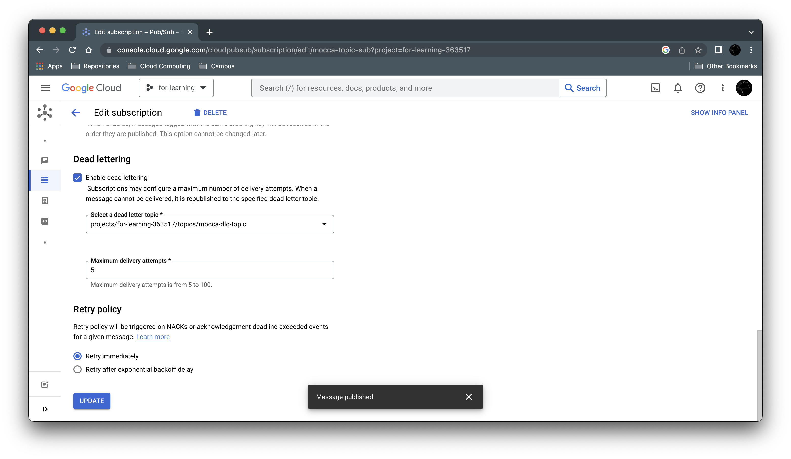
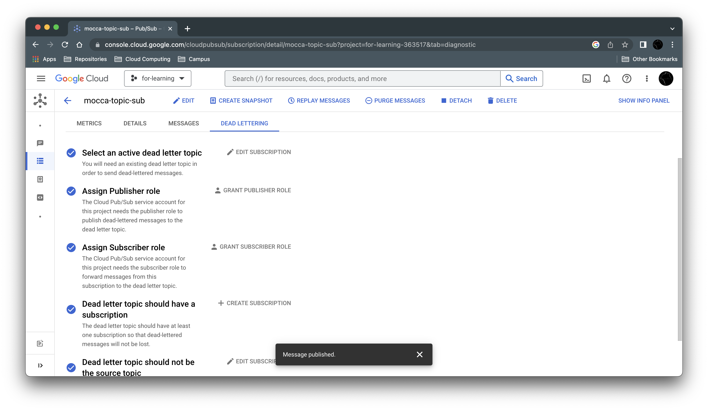

# Golang GCP Pubusb with Dead Letter Queue(DLQ)

> This edition of Google Cloud Compute (GCP)

what is DLQ? DLQ is condition when message is not ACK for a N retry from subscriber, and will publish the another subsubcriber. 

to set it you can follow this instruction

In Edit, Checklist Dead and select the topic who using DLQ and subscriber

Grant all Acccess Publisher role

